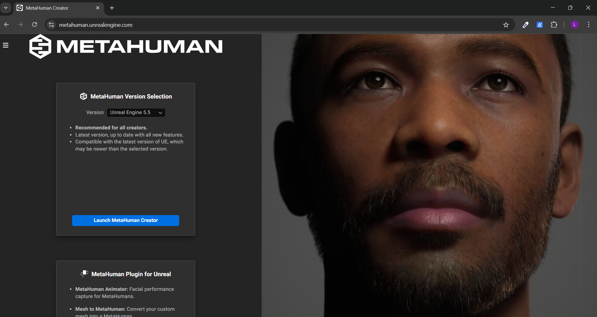
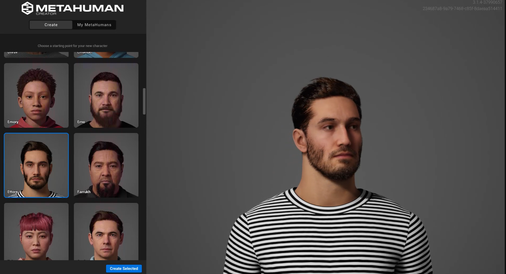
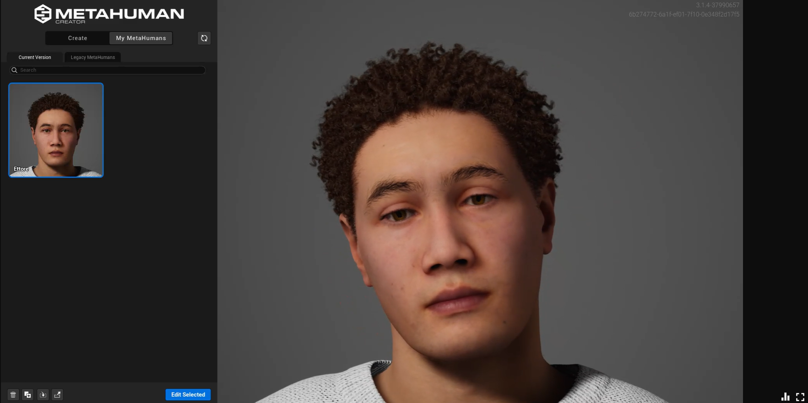
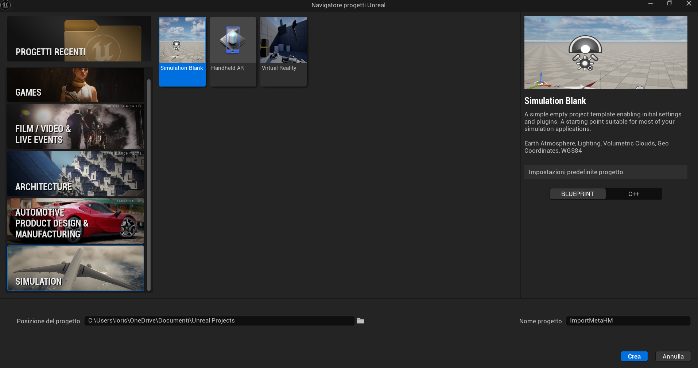

# From Scratch to Twin: The Design of your First Human-Centric Digital Twin #

This repository contains the official implementation for the paper [From Scratch to Twin: The Design of your First Human-Centric Digital Twin](https://esd-univr.github.io/from_scratch_to_twin/), accepted at the 34th IEEE International Symposium on Industrial Electronics (ISIE 2025).

[](https://ieeexplore.ieee.org/abstract/document/11124810)
[](https://ieee-isie2025.org/)

## 📖 Overview ##

This guide provides the walkthrough for creating a personal, Human-Centric Digital Twin.
The process leverages **MetaHuman Creator** for realistic avatar generation and **Unreal Engine** for simulation, integrating a real-time AI model for state monitoring.
The goal is to build a "Digital Shadow" that mirrors an operator's state (*e.g.*, wakefulness) and evolves into a "Digital Twin" with predictive and interactive capabilities.

## 🛠️ Part 1: MetaHuman Creation and Import ##

This section details the creation of the digital avatar and its integration into the Unreal Engine environment.

### 1. MetaHuman Avatar Creation ###

First, you will design your personalized avatar using Epic Games' MetaHuman Creator.

1.  **Access MetaHuman Creator**: Navigate to the official [MetaHuman Creator website](https://metahuman.unrealengine.com/).
2.  **Launch the Application**: Select the appropriate version for your system and launch the tool.
    <p align="center">
        
    </p>
3.  **Customize Your Avatar**: Use the available tools to customize the appearance of your MetaHuman. For a detailed guide on the customization features, refer to the official Epic Games tutorial: 📺 [Simple Features of MetaHuman Creator](https://www.youtube.com/watch?v=6GZ2M5j1RC8).
    <p align="center">
        
    </p>
4.  **Export Your MetaHuman**: Once customization is complete, export the MetaHuman. This makes it available in Quixel Bridge for later import into Unreal Engine.
    <p align="center">
        
    </p>

### 2. Unreal Engine Setup and Import ###

Next, prepare the simulation environment and import your created MetaHuman.

1.  **Prerequisites**:
    *   Create an **Epic Games** account.
    *   Download and install the **Epic Games Launcher**.
    *   Install a suitable version of **Unreal Engine**.
2.  **Create a New Project**: Launch Unreal Engine and create a new project using the **Games > Blank** template.
    <p align="center">
        
    </p>
3.  **LiveLink Connection and MetaHuman Import**:
    To connect a mobile device for facial tracking and import the MetaHuman, follow this comprehensive tutorial. It covers:
    *   Installing the **LiveLink** application on your mobile device.
    *   Connecting your mobile device to your PC.
    *   Importing your custom MetaHuman via **Quixel Bridge**.
    *   📺 [Tutorial: LiveLink and MetaHuman Import](https://www.youtube.com/watch?v=rFKXFdtCrfA).

At this stage, you have successfully created a **Digital Shadow**—a real-time, virtual representation of a physical counterpart.

## 🤖 Part 2: AI Integration and Digital Twin Realization ##

This section covers the development and integration of the AI model that enables the transition from a Digital Shadow to a functional Digital Twin.

### 1. Data Collection and AI Model Training ###

The core of the Digital Twin is an AI model trained to detect the operator's state.

*   **Data Collection**: We developed a Python script to automate screenshot capture from Unreal Engine, ensuring a diverse dataset of the operator's avatar from multiple angles. We collected 39 images for each state ("awake" and "drowsy"), for a total of 78 images. These were manually annotated using [CVAT](https://www.cvat.ai/).
*   **AI Model (YOLOv8)**: Our wakefulness and drowsiness detection model is based on **YOLOv8**, a state-of-the-art, real-time object detection architecture. The model processes video frames of the operator and outputs bounding boxes with confidence scores, classifying the subject as "awake" or "drowsy".
    *   For more information on YOLO, visit the official repository: [Ultralytics YOLO](https://github.com/ultralytics/ultralytics).
    *   For a guide on integrating YOLO with Unreal Engine, see this tutorial: 📺 [YOLO Inside Unreal Engine](https://www.youtube.com/watch?v=xpqiAvuAUfk).

### 2. Human-Centric Digital Twin Architecture ###

The final step is to create a client-server architecture to link the AI model with the Unreal Engine simulation.

*   **Client-Server Integration**: A Python server manages real-time communication between the YOLOv8 model and Unreal Engine. The server continuously monitors the operator via a webcam.
*   **Real-Time Monitoring**: The server captures frames of the operator using `pyautogui.screenshot()`. YOLOv8 processes each frame (approx. 30 ms), and the prediction is sent to Unreal Engine via a socket. The average end-to-end latency between a physical state change and the virtual MetaHuman's response was measured at **550 milliseconds**.
*   **Safety Feature**: As a practical application, if the model detects "drowsy" for more than three consecutive seconds, the system triggers an audible alarm 🚨, which persists until the operator's state returns to "awake".

With this integration, you have transformed the Digital Shadow into your first **Digital Twin**, capable of sensing, processing, and reacting to real-world conditions.

## You obtain your first Digital Twin! ✅ ##

## Authors ##
Francesco Biondani, Luigi Capogrosso, Marco Cristani, Franco Fummi

*Department of Engineering for Innovation Medicine, University of Verona, Italy*

## Citation ##
If you use [**From Scratch to Twin**](https://ieeexplore.ieee.org/abstract/document/11124810), please, cite the following paper:
```
@InProceedings{biondani2025scratch,
  author    = {Biondani, Francesco and Capogrosso, Luigi and Cristani, Marco and Fummi, Franco},
  booktitle = {2025 IEEE 34th International Symposium on Industrial Electronics (ISIE)},
  title     = {{From Scratch to Twin: the Design of Your First Human-Centric Digital Twin}},
  year      = {2025},
  doi       = {10.1109/isie62713.2025.11124810},
}
```